```{r setup, include=FALSE}
knitr::opts_chunk$set(echo = FALSE)
```

## AR12673 {.flexbox .vcenter .smaller}

<blockquote class="twitter-tweet" data-lang="en"><p lang="en" dir="ltr">X2.2 and X9.3 flares from <a href="https://twitter.com/hashtag/AR12673?src=hash">#AR12673</a> today. They were both gorgeous flares, but there is huge difference in terms of their possible geo-impact <a href="https://t.co/5caTxLZu9k">pic.twitter.com/5caTxLZu9k</a></p>&mdash; Halo CME (@halocme) <a href="https://twitter.com/halocme/status/905496088513269763">September 6, 2017</a></blockquote>
<script async src="//platform.twitter.com/widgets.js" charset="utf-8"></script>

<!-- <iframe width="400" height="225" src="https://twitter.com/halocme/status/905496088513269763" frameborder="0"></iframe> -->

## Tom Bogdan {.flexbox .vcenter .smaller}

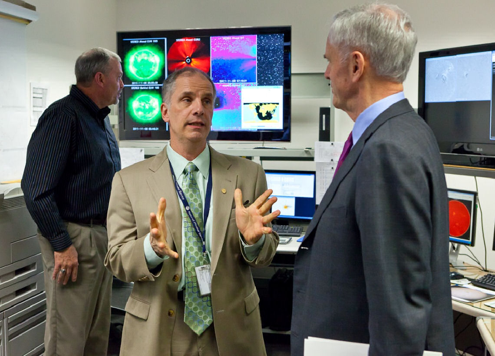

* Director, Space Weather Prediction, NOAA 2006 - 2012
* President, University Corporation for Atmospheric Research, 2012 - 2015

## Big Picture | Tom Bogdan {.flexbox .vcenter}

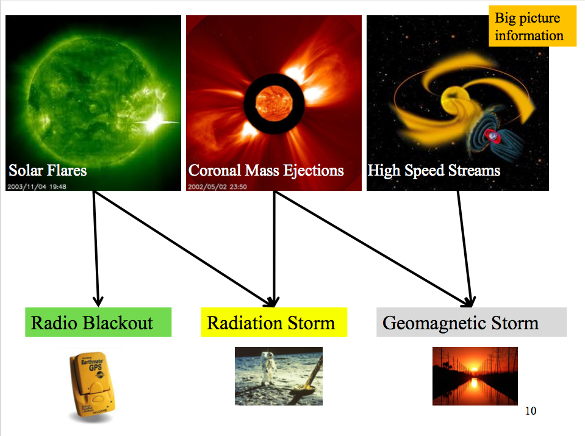

## Big Picture {.flexbox .vcenter .smaller}

Customer Impacts

* Aviation
    + HF Communications used for Air Traffic Control
    + GPS enabled approach and landing in use at major airports
    + Radiation doses to flight crews and passengers
* Precision GPS
    + Ubiquitous in construction and agriculture
    + Transportation network monitoring
    + Timing/sync for telecom, power grid, and financial systems
* Satellites
    + Telecommunications relay for the planet
    + Surveillance and reconnaissance
    + National security assets on orbit
    + On demand entertainment
* Power Grid

## Outline

1. Frontier Development Lab
2. Heliophysics
3. The Data
4. Deep Learning
5. Going Forward

# Frontier Development Lab

## FDL {.flexbox .vcenter .smaller}

> NASA Frontier Development Lab is an AI R&D accelerator that tackles knowledge gaps useful to the space program. The program is an intense 8-week concentrated study on topics not only important to NASA, but also to humanity’s future.


## Space Camp... 25 Years Later {.flexbox .vcenter .smaller}

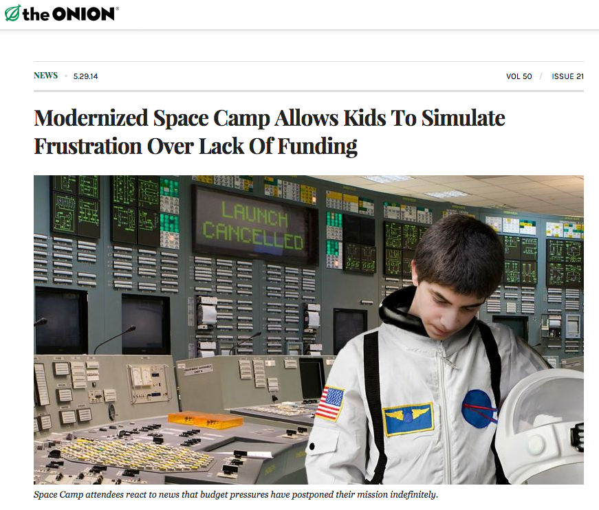

## NASA Ames {.flexbox .vcenter .smaller}

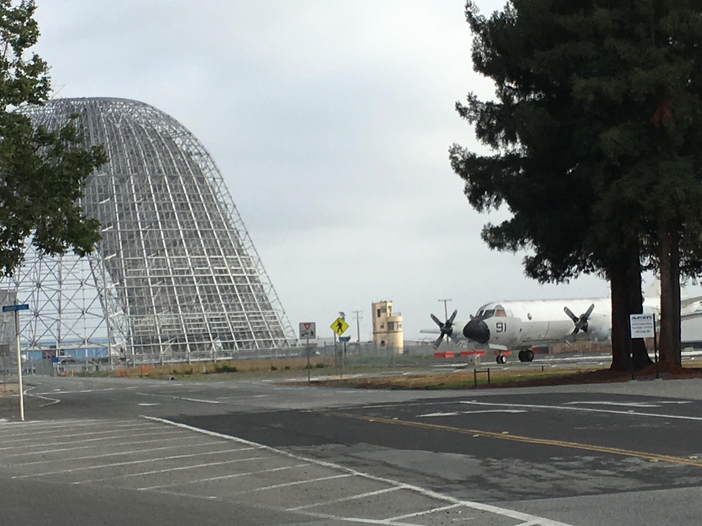

## IBM's Partnership | ME!!! {.flexbox .vcenter}

Also, 16 of these for 2 months

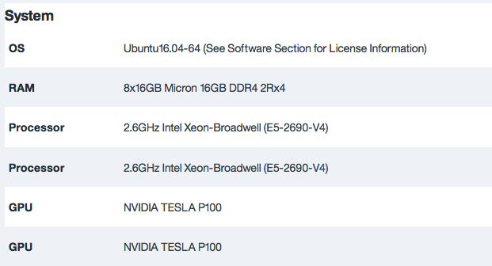

## 5 Teams

- Radar 3D Shape Modeling
- Long Period Comets
- Lunar Water and Volatiles
- Solar Storm Prediction
- Solar-Terrestrial Interactions

## 5 Teams

- Radar 3D Shape Modeling
- Long Period Comets
- Lunar Water and Volatiles
- **Solar Storm Prediction**
- Solar-Terrestrial Interactions

## XKCD 1831 | Here to Help {.flexbox .vcenter}


# Heliophysics

## XKCD 1851 | Magnetohydrodynamics {.flexbox .vcenter}


## Youtube Video

<iframe width="400" height="225" src="https://www.youtube.com/embed/ReSi_kPTNIc?rel=0&amp;start=91" frameborder="0"></iframe>

## Big Picture | Tom Bogdan {.flexbox .vcenter}


# The Data

## X-ray Flux {.flexbox .vcenter .smaller}

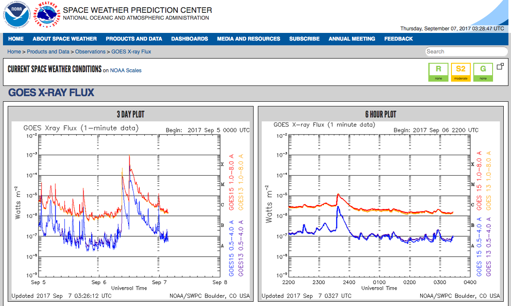

http://www.swpc.noaa.gov/products/goes-x-ray-flux

## GOES 15 {.flexbox .vcenter}

From March 2010:

https://www.ngdc.noaa.gov/stp/satellite/goes/dataaccess.html

https://satdat.ngdc.noaa.gov/sem/goes/data/new_full/2010/04/goes15/

## Teamwork! {.flexbox .vcenter}

```{r, echo = TRUE, cache=TRUE}
flux <- read.csv("data/Flux_2010_2015.csv")
head(flux)
```

Need a script like the following one to pull down the CSVs.

Take the max over some interval.

## X-ray Flux {.flexbox .vcenter .smaller}

```{r, echo = FALSE, cache=TRUE}
flux$Time <- as.POSIXct(flux$Time, format = "%Y-%m-%d %H:%M:%S", tz = "UTC")
plot(flux[1:100000, 1:2], type = "l", xlab = "Date", ylab = "X-ray Flux",
     ylim = c(0, 10e-4))
abline(10e-04, 0)
abline(10e-05, 0, col = 2)
abline(10e-06, 0, col = 3)
abline(10e-07, 0, col = 4)
legend("topright", legend = c("X-class", "M-class", "C-class", "B-class"),
          lty = 1, col = 1:4, cex = .75)
```

## X-ray Flux Log {.flexbox .vcenter .smaller}

```{r, echo = FALSE, cache=TRUE}
plot(x = flux[1:100000, 1], y = log(flux[1:100000, 2]), type = "l", xlab = "Date", ylab = "X-ray Flux")
abline(log(10e-04), 0)
abline(log(10e-05), 0, col = 2)
abline(log(10e-06), 0, col = 3)
abline(log(10e-07), 0, col = 4)
legend("topright", legend = c("X-class", "M-class", "C-class", "B-class"),
          lty = 1, col = 1:4, cex = .75)
```


## Solar Dynamics Observatory (SDO) {.flexbox .vcenter .smaller}

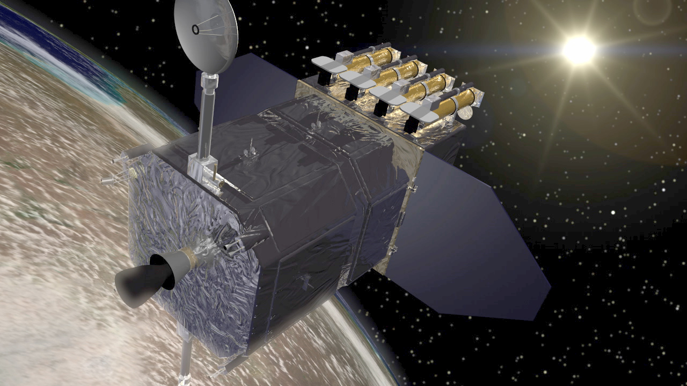

> The Solar Dynamics Observatory (SDO) is a NASA mission which has been observing the Sun since 2010. Launched on February 11, 2010, the observatory is part of the Living With a Star (LWS) program.

https://en.wikipedia.org/wiki/Solar_Dynamics_Observatory

## Atmospheric Imaging Assembly (AIA)

* Led from the Lockheed Martin Solar and Astrophysics Laboratory (LMSAL)
* Provides continuous full-disk observations of the solar chromosphere and corona in 8 channels/temperatures
* Image stream provides unprecedented views of the various phenomena that occur within the evolving solar outer atmosphere
    + 12-second cadence
    + 4096 by 4096 pixels
    + 2010 - Present

## Petabytes of data

* Image stream provides unprecedented views of the various phenomena that occur within the evolving solar outer atmosphere
    + 12-second cadence -> 12-minute cadence
    + 4096 by 4096 pixels -> 1024 by 1024 pixels
    + 2010 - Present -> 2014 (Jan-Jun)

From PBs to GBs...

## Downloading that data {.smaller}

```{r, echo = TRUE, eval = FALSE}
create.file.list <- function(which.months = 1:6){
  base.url <- "http://jsoc.stanford.edu/data/aia/synoptic/2014/"
  months <- sprintf("%02.f", 1:12)[which.months]
  max.days <- c(31, 28, 31, 30, 31, 30, 31, 31, 30, 31, 30, 31)[which.months]
  hours <- sprintf("%02.f", 0:23)
  minutes <- sprintf("%02.f", c(00, 12, 24, 36, 48))
  wl <- c("0094", "0131", "0171", "0193", "0211", "0304", "0335", "1600")
  target.file.list <- target.urls <- rep("", sum(max.days) * 5 * 24 * 8)
  ind <- 1
  for(i in 1:length(months)){
    for(j in 1:(max.days[i])){
      for(k in 1:length(hours)){
        for(l in 1:length(minutes)){
          for(m in 1:length(wl)){
            aia.url <- paste0(base.url, months[i], "/",
                              sprintf("%02.f", j), "/H", hours[k], "00/")
            aia.file <- paste0("AIA2014", months[i],
                               sprintf("%02.f", j), "_", hours[k], minutes[l], "_", wl[m], ".fits")
            target.file.list[ind] <- aia.file
            target.urls[ind] <- paste0(aia.url, aia.file)
            ind <- ind + 1
          }
        }
      }
    }
  }
  target.files <- list(target.file.list, target.urls)
}
```

## Downloading that data

```{r, echo = TRUE, eval = FALSE}
download.aia.2014 <- function(target.dir = "data/AIA2014/",
                              target.file.list, target.urls){
  # Check existing files
  lf <- list.files(target.dir)
  done.list <- which(target.file.list %in% lf)
  if(length(done.list) > 0){
    todo.list <- c(1:length(target.file.list))[-done.list]
  } else {
    todo.list <- c(1:length(target.file.list))
  }

  # Download only missing data  
  for(i in 1:length(todo.list)){
    try(download.file(url = target.urls[todo.list[i]],
                  destfile = paste0(target.dir,
                                    target.file.list[todo.list[i]]),
                  method = "libcurl"),
        silent = TRUE)
  }
}
```
## Downloading that data

We'll only look at the first two samples of data; i.e. the first 16 fits files.

```{r, echo = TRUE, eval = FALSE}
temp.file.list <- create.file.list(which.months = 1)
download.aia.2014(target.dir = "data/AIA2014/",
                  target.file.list = temp.file.list[[1]][1:16],
                  target.urls = temp.file.list[[2]][1:16])
```

## Generate all channel index {.smaller}

```{r, echo = TRUE, eval = TRUE, cache = TRUE}
aia.index.allchannels <- function(target.dir = "data/",
                                  target.file.dir = "data/AIA2014/"){
  lf <- list.files(target.file.dir)
  time.stamp <- substr(lf, 1, 16)
  wave.length <- substr(lf, 18, 21)
  time.wave.tbl <- table(time.stamp, wave.length)
  time.wave.tbl8 <- time.wave.tbl[, 1:8]
  num.channels <- apply(time.wave.tbl8, 1, sum)
  all.channels <- num.channels == 8
  sum(all.channels)
  all.channels.times <- rownames(time.wave.tbl8)[all.channels]
  year <- as.numeric(substr(all.channels.times, 4, 7))
  month <- as.numeric(substr(all.channels.times, 8, 9))
  day <-as.numeric(substr(all.channels.times, 10, 11))
  hour <- as.numeric(substr(all.channels.times, 13, 14))
  minute <- as.numeric(substr(all.channels.times, 15, 16))
  AIAindex.allchannels <- cbind(year, month, day, hour, minute)
  AIAindex.allchannels.POSIX <- as.POSIXct(paste(
    paste(AIAindex.allchannels[, 1],
          sprintf("%02.f", AIAindex.allchannels[, 2]),
          sprintf("%02.f", AIAindex.allchannels[, 3]), sep = "-"),
    paste(sprintf("%02.f", AIAindex.allchannels[, 4]),
          sprintf("%02.f", AIAindex.allchannels[, 5]), "00", sep = ":"),
    sep = " "), tz = "UTC")
  write.csv(AIAindex.allchannels.POSIX,
            paste0(target.dir, "AIA_index_allChannels_", Sys.Date(),".csv"),
            row.names = F)
}
```

## On file type choices

1. Binaries are fast, you should use them. They are faster and smaller
    + R: Rds
    + Python: npy
    + Cross-functional team: feather!
2. If you doing deep learning, you should use their supported type:
    + Tensorflow - Standard TF Format, FWF, CSV
        + https://www.tensorflow.org/api_guides/python/reading_data
    + MxNet - Record IO, image data, CSV
        + https://mxnet.incubator.apache.org/tutorials/basic/data.html
3. Tensorflow $\cap$ MxNet == CSV
    + Custom iterators exist, but... more on this later.

## Generate Usable Data

```{r, echo = TRUE, eval = TRUE, message = FALSE, cache = TRUE}
library(doParallel)
library(foreach)
library(feather)
library(reticulate)
registerDoParallel(cores=detectCores())
astropy <- import("astropy")
aia.index.allchannels(target.dir = "data/", target.file.dir = "data/AIA2014/")
```

1. Convert to Feather
2. Take mean, sd of logged values
3. Create PCA model
3. Apply mean, sd, PCA
4. Take mean, sd of PCA-ed data

## Generate Usable Data - Feather  {.smaller}

```{r, echo = TRUE, eval = FALSE}
lf <- list.files("data/AIA2014/")
target.dir = "data/"
all.channel.index.POSIX <- as.POSIXct(read.csv(paste0(target.dir,
                                                      "AIA_index_allChannels_",
                                                      Sys.Date(),".csv"),
                                               stringsAsFactors = FALSE)[[1]],
                                      tz = "UTC", format = "%Y-%m-%d %H:%M:%S")

all.channel.index <- outer(format(all.channel.index.POSIX, "%Y%m%d_%H%M"),
                           c("_0094", "_0131", "_0171", "_0193",
                             "_0211", "_0304", "_0335", "_1600"),
                           paste, sep = "")


foreach(i = 1:nrow(all.channel.index)) %dopar% {
  big.mat <- matrix(NA, nrow = 1024*1024, ncol = 8)
  for(j in 1:8){
    temp <- astropy$io$fits$open(paste0("data/AIA2014/AIA", all.channel.index[i, j], ".fits"))
    temp$verify("fix")
    exp.time <- as.numeric(substring(strsplit(as.character(temp[[1]]$header),
                                              "EXPTIME")[[1]][2], 4, 12))
    temp.mat <- temp[[1]]$data
    temp.mat[temp.mat <= 0] <- 0
    temp.mat <- temp.mat + 1
    big.mat[, j] <- c(t(temp.mat / exp.time))
  }
  write_feather(as.data.frame(big.mat), paste0("data/FeatherAIA2014/AIA",
                       format(all.channel.index.POSIX[i], "%Y%m%d_%H%M"),
                       ".feather"))
}
```

## Generate Usable Data - Data Exploration {.flexbox .vcenter .smaller}

```{r, echo = TRUE, cache = TRUE}
lf.train <- list.files("data/FeatherAIA2014/")

temp.mat <- read_feather(paste0("data/FeatherAIA2014/", lf.train[1]))
hist(as.matrix(temp.mat)[, 1])
```

## Generate Usable Data - Data Exploration {.flexbox .vcenter .smaller}

```{r, echo = TRUE, cache = TRUE}
hist(log(as.matrix(temp.mat))[, 1])
```


## Generate Usable Data - Data Exploration {.flexbox .vcenter .smaller}

```{r, echo = TRUE, cache = TRUE}
image(matrix(as.matrix(temp.mat)[, 1], nrow = 1024), zlim = c(-2, 2),
      xaxt = "n", yaxt = "n")
```

## Generate Usable Data - Data Exploration {.flexbox .vcenter .smaller}

```{r, echo = TRUE, cache = TRUE}
image(matrix(log(as.matrix(temp.mat))[, 1], nrow = 1024), zlim = c(-2, 2),
      xaxt = "n", yaxt = "n")
```

## Generate Usable Data - Data Exploration {.flexbox .vcenter .smaller}

Untransformed AIA Images

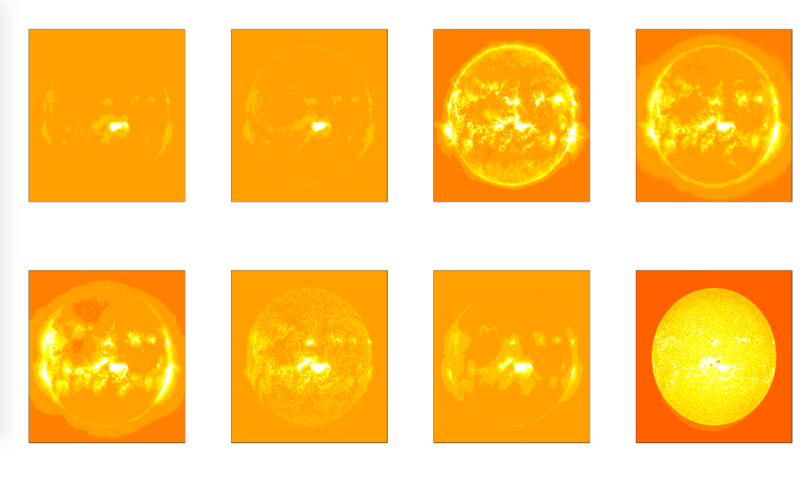

## Generate Usable Data - Data Exploration {.flexbox .vcenter .smaller}

Logged AIA Images

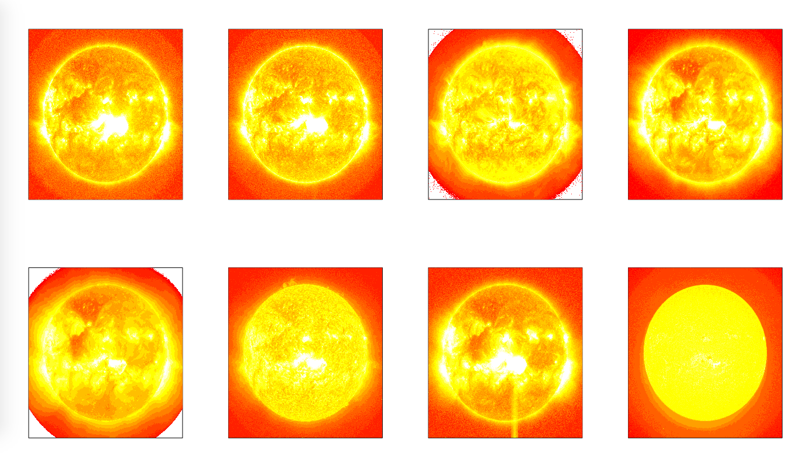

## Generate Usable Data - Data Exploration {.flexbox .vcenter .smaller}

Logged, centered, scaled, PCA-ed AIA Images

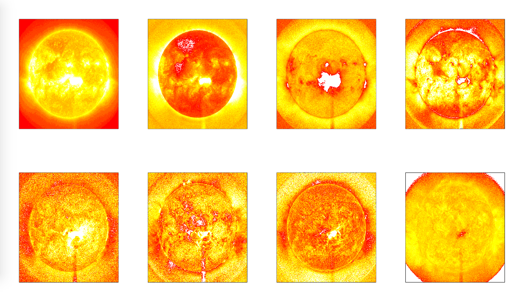

## Generate Usable Data - Scale  {.smaller}

```{r, echo = FALSE, eval = TRUE}
target.dir = "data/"
all.channel.index.POSIX <- as.POSIXct(read.csv(paste0(target.dir,
                                                      "AIA_index_allChannels_",
                                                      Sys.Date(),".csv"),
                                               stringsAsFactors = FALSE)[[1]],
                                      tz = "UTC", format = "%Y-%m-%d %H:%M:%S")
```

```{r, echo = TRUE, eval = FALSE}
mean.log <- foreach(i = 1:length(lf.train), .combine = rbind) %dopar% {
  file.name <- paste0("data/FeatherAIA2014/AIA",
                      format(all.channel.index.POSIX[i], "%Y%m%d_%H%M"),
                      ".feather")

  temp.mat <- read_feather(file.name)
  apply(log(temp.mat), 2, mean)
}

write.csv(mean.log, "data/MeanPostLog.csv", row.names = FALSE)
mean.vec <- apply(mean.log, 2, mean)
```

## Generate Usable Data - Scale  {.smaller}

```{r, echo = TRUE, eval = FALSE}
sd.log <- foreach(i = 1:length(lf.train), .combine = rbind) %dopar% {
  file.name <- paste0("data/FeatherAIA2014/AIA",
                      format(all.channel.index.POSIX[i], "%Y%m%d_%H%M"),
                      ".feather")

  temp.mat <- read_feather(file.name)
  apply(t(t(temp.mat) - mean.vec), 2, sd)
}

write.csv(sd.log, "data/SdPostLog.csv", row.names = FALSE)
sd.vec <- sqrt(apply(sd.log ^ 2, 2, mean))

```

## Generate Usable Data - CSV  {.smaller}

```{r, echo = TRUE, eval = FALSE}
lf <- list.files("data/FeatherAIA2014/")
foreach(i = 1:length(lf)) %dopar% {
  temp.mat <- as.matrix(read_feather(paste0("data/FeatherAIA2014/", lf[i])))
  # Take all 8 dimensions and flatten out.
  temp.mat <- round(c(t((t(temp.mat) - mean.vec) / sd.vec)[, 1:8]), 2)
  
  write.table(matrix(temp.mat, nrow = 1),
                     paste0("data/CSVAIA2014/", substring(lf[i], 1, 16), ".csv"),
              sep=',', row.names=FALSE, col.names=FALSE)
}

```

## Generate One Big CSV  {.smaller}

```{r, echo = TRUE, eval = FALSE}
lf <- list.files("data/CSVAIA2014/")

cat.str <- paste0("cat ", paste(lf, collapse = " "),
                  " > data/AIA2014_Big.csv")
cat.str
system(cat.str)
```

```{r, echo = FALSE, eval = TRUE}
lf <- list.files("data/CSVAIA2014/")

cat.str <- paste0("cat ", paste(lf, collapse = " "),
                  " > data/AIA2014_Big.csv")
cat.str
```

# Deep Learning

## XKCD 1838 | Machine Learning {.flexbox .vcenter}


## Deep Learning

> is just a rebranding of neural networks.
* Geoff Hinton(?), (paraphrased from memory)
* Deep Learning Summer School, UCLA, 2012


https://www.ipam.ucla.edu/programs/summer-schools/graduate-summer-school-deep-learning-feature-learning/

## Deep Learning

> “There has been a great deal of hype surrounding neural networks, making them seem magical and mysterious…”

* Elements of Statistical Learning


## Frameworks {.smaller}

* Tensorflow
    + Google
    + Python -> C++
    + In R:
      + Supported by Rstudio
      + R -> Python -> C++

* MXNet
    + Amazon
    + Almost anything -> C++
    + In R:
      + Supported by Rcpp Core Team
      + R -> C++

## Frameworks {.smaller}

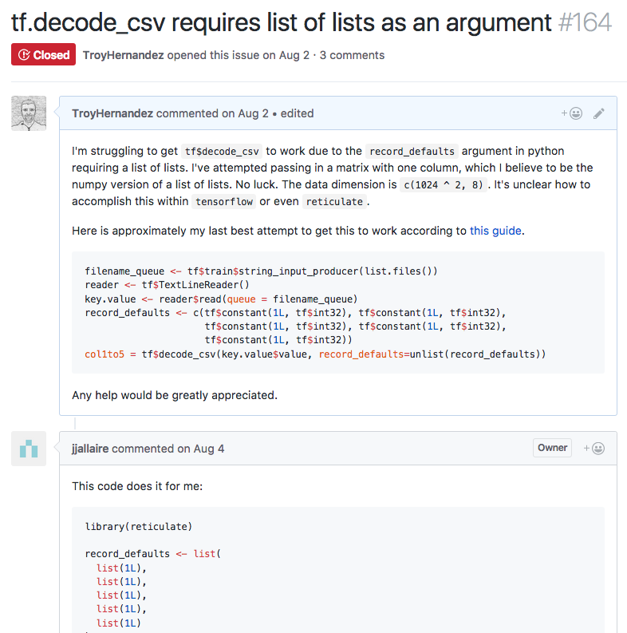

## Tensorflow

* Seemed to have a memory leak
    + Memory management on the GPU is important
* Couldn't get the iterator/data loading function to work
    + CPU should asynchronously load data into GPU while it's working
    + Hence the JJ intervention
    + Need this to get full force of the GPU
* My team used Keras (in Python) to access Tensorflow as a backend

## Tensorflow


## MXNet

* No memory leak
    + 100% GPU usage!
* Iterator function worked
    + Need to move from clunky CSVs to something more performant
* Still no success :|


# Engineering Considerations

## Data

I've talked enough about data, but clearly you need lots of storage.

## Hardware


## Hardware

* GPUs are important.
* 10x speed up over CPUs (54 threads)
* Rich man's game :/
* Suggest getting a cheap GPU or high end CPU to develop
    + Move it over to the cloud (Softlayer, AWS) for scaling up
    + Going to want your data in cloud storage for that

# Going Forward

## Open Problem!

* My team was able to get many of the data issues sorted.
* Our best networks were either predicting constant values or overfit
* Still no success :|
    + 1024x1024 images are 16x bigger than Imagenet
    + 20k images are 50x fewer than Imagenet
    + Knowing the correct architecture is the key 
* The Earth (and your entertainment depends on it).
* The perfect opportunity to try deep learning in R.

# The End
